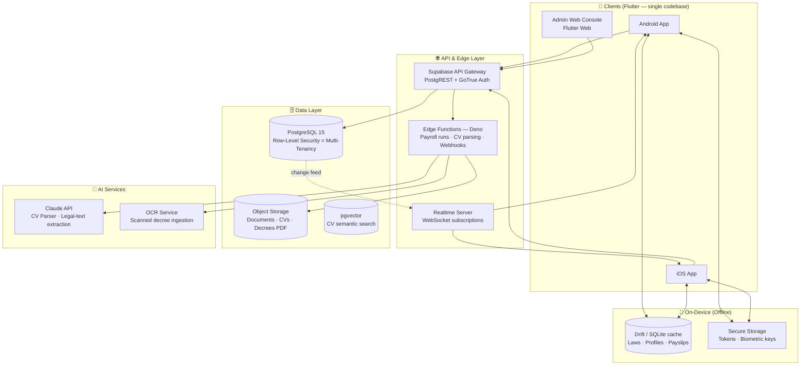
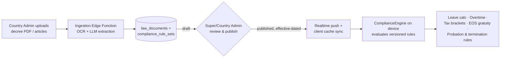

# 01 — System Architecture Blueprint

## 1. High-Level Architecture



## 2. Clean Architecture (per feature module)

Every feature (`auth`, `compliance`, `attendance`, `payroll`, …) is a vertical slice with
strict inward-pointing dependencies:

```
lib/features/<feature>/
├── domain/          # Entities + value objects + repository INTERFACES (pure Dart, zero deps)
├── application/     # Use-cases / controllers (Riverpod Notifiers) — business rules
├── data/            # Repository IMPLEMENTATIONS: Supabase remote + Drift local + mappers
└── presentation/    # Widgets, screens, view-state (depends on application only)
```

**Dependency rule:** `presentation → application → domain ← data`.
The domain layer never imports Flutter, Supabase, or Drift. Repositories are injected via
Riverpod providers, so every layer is testable in isolation.

## 3. Multi-Tenancy Model

- One PostgreSQL cluster, shared schema, **tenant isolation via Row-Level Security (RLS)**.
- Every tenant-owned table carries `tenant_id uuid not null`.
- The JWT issued by Supabase Auth embeds `tenant_id`, `role`, and `country_code` as custom
  claims; RLS policies compare them against each row. A compromised client **cannot** read
  another tenant's rows — isolation is enforced in the database, not in app code.
- Global content (labor laws, decrees, rule-sets) lives in country-scoped tables with
  `tenant_id IS NULL` and is world-readable but writable only by Country/Super Admins.

## 4. RBAC — Three Enforcement Layers

| Layer | Mechanism |
|---|---|
| Database | RLS policies keyed on JWT claims (`role`, `tenant_id`) — the source of truth |
| API / Edge Functions | Claim checks before privileged operations (payroll run, law publish) |
| Client | `RoleGate` widget + GoRouter redirect guards (UX only, never trusted for security) |

Role hierarchy: `superAdmin > countryAdmin > tenantAdmin > employee > guest`.
Permissions are additive capability sets (see `app/lib/features/auth/domain/user_role.dart`).

## 5. Dynamic Multi-Country Compliance Engine

The core differentiator. Laws are **data, not code**:



Key design points:

1. **Versioned rule-sets** — each `compliance_rule_set` row has `country_code`,
   `effective_from`, `effective_to`, `version`, `status (draft/published/archived)`.
   Payroll for June is computed with the rule-set effective in June, even if a new decree
   landed in July → full auditability and retroactive correctness.
2. **Typed rule schema (JSON)** — rules are declarative parameters interpreted by a typed
   engine (`ComplianceEngine` in `app/lib/features/compliance/`), e.g.:

```jsonc
{
  "country_code": "EG",
  "version": 3,
  "effective_from": "2025-09-01",
  "annual_leave": {
    "base_days": 21,
    "tiers": [{ "min_service_years": 10, "days": 30 }, { "min_age": 50, "days": 30 }],
    "probation_months_before_eligible": 6
  },
  "working_hours": { "max_daily": 8, "max_weekly": 48 },
  "overtime": { "day_multiplier": 1.35, "night_multiplier": 1.70, "holiday_multiplier": 2.0 },
  "income_tax_brackets": [
    { "up_to": 40000, "rate": 0.0 },
    { "up_to": 55000, "rate": 0.10 },
    { "up_to": 70000, "rate": 0.15 },
    { "up_to": 200000, "rate": 0.20 },
    { "up_to": 400000, "rate": 0.225 },
    { "up_to": 1200000, "rate": 0.25 },
    { "up_to": null,   "rate": 0.275 }
  ],
  "social_insurance": { "employee_rate": 0.11, "employer_rate": 0.1875, "salary_cap": 14500 },
  "end_of_service": { "type": "none" },
  "termination": { "notice_days_lt_10y": 60, "notice_days_gte_10y": 90 }
}
```

3. **Country switch = data switch** — when a tenant (or employee) selects a country, every
   downstream module (leave, overtime, payroll, termination) automatically consumes that
   country's active rule-set. No conditional country logic in code.
4. **Fallback & cache** — the latest published rule-set per country is cached in SQLite for
   offline reads; the engine refuses to run *payroll* on stale rules older than a
   configurable threshold (compliance safety).

## 6. Functional Module Map

| Module | Core Services | Key Tables |
|---|---|---|
| Talent Acquisition | ATS CV Builder (templated, PDF export), AI CV Parser (LLM structured extraction → `cv_profiles`), job board, application pipeline | `job_postings`, `applications`, `cv_profiles` |
| Core HR | Onboarding/offboarding workflow engine (state machines), document vault, digital employee profiles | `employees`, `employee_documents`, `workflows`, `workflow_steps` |
| Time & Attendance | Geo-fenced clock-in (Haversine check vs `work_sites`), FaceID/Fingerprint gate (`local_auth`), shift scheduling, leave workflows validated by ComplianceEngine | `attendance_records`, `shifts`, `leave_requests`, `work_sites` |
| Payroll | Country-rule payroll runs (Edge Function, idempotent, effective-dated rules), payslip PDF generation, multi-currency | `payroll_runs`, `payroll_items`, `payslips`, `salary_structures` |
| Performance | KPI/OKR trees, review cycles, 360° feedback | `objectives`, `key_results`, `review_cycles`, `evaluations` |
| Compliance | Decree ingestion, rule-set authoring/review/publish, law library (searchable, offline) | `law_documents`, `compliance_rule_sets` |

## 7. AI CV Parser — Logic Blueprint

1. Upload (PDF/DOCX/image) → Storage bucket `cvs/` (tenant-scoped path).
2. Edge Function `parse-cv`: text extraction (pdf-parse / OCR for scans).
3. LLM call with a **strict JSON schema** (tool-use / structured output): personal info,
   experience[], education[], skills[], languages[], certifications[].
4. Confidence scoring per field; low-confidence fields flagged for human review in UI.
5. Persist to `cv_profiles` + embedding into `pgvector` for semantic candidate search
   ("find senior payroll specialists with SAP, Arabic-speaking").
6. PII is encrypted at rest (pgsodium column encryption) and access-logged.

## 8. Security & Privacy

- **Transport:** TLS 1.3 everywhere; certificate pinning in the mobile app.
- **At rest:** PostgreSQL encryption + `pgsodium` column-level encryption for salaries,
  national IDs, bank details (`encrypted_*` columns).
- **On device:** `flutter_secure_storage` (Keychain/Keystore) for tokens; SQLCipher option
  for the Drift cache; biometric unlock before payslip/salary screens.
- **GDPR:** data-subject export & erasure Edge Functions, `consent_records` table,
  `audit_logs` (immutable, append-only) for every access to sensitive data, per-country
  data-residency ready (Supabase project per region if required).
- **Auth:** short-lived JWTs + refresh rotation, MFA for admin roles, device binding.

## 9. Offline Strategy

| Data | Policy |
|---|---|
| Labor laws & rule-sets | Full offline replica, background sync (read-only) |
| Own profile, payslips, leave history | Cached after first fetch, TTL refresh |
| Attendance clock-in/out | **Offline queue** → signed events replayed on reconnect (server validates timestamps + geo) |
| Payroll runs, admin publishing | Online-only (integrity-critical) |
