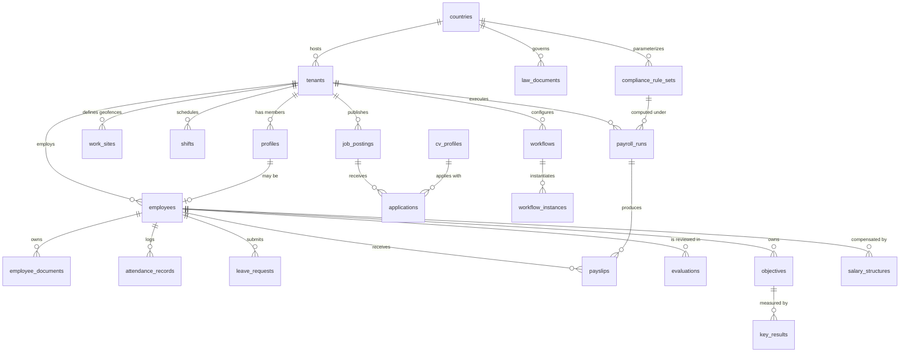

# 02 — Database Schema & Relationships

PostgreSQL 15 (Supabase). Multi-tenancy via Row-Level Security. Full DDL lives in
`supabase/migrations/0001_initial_schema.sql`.

## ERD (core relationships)

## Table Groups

### Identity & Tenancy
| Table | Purpose | Key columns |
|---|---|---|
| `countries` | ISO country registry | `code (PK)`, `name_en`, `name_ar`, `currency_code`, `default_locale`, `is_active` |
| `tenants` | Companies (workspaces) | `id`, `country_code → countries`, `name`, `plan`, `status`, `settings jsonb` |
| `profiles` | 1:1 with `auth.users`; carries role | `id (= auth.users.id)`, `tenant_id?`, `role`, `country_scope?`, `locale`, `theme_pref` |

`role ∈ {super_admin, country_admin, tenant_admin, employee, guest}`.
`country_scope` is set only for country admins (the country they moderate).

### Compliance Engine (global content — `tenant_id` is NULL)
| Table | Purpose |
|---|---|
| `law_documents` | Official decrees/articles: `country_code`, `title_en/ar`, `body_en/ar`, `source_url`, `document_type (decree/article/amendment/circular)`, `issued_at`, `storage_path` (original PDF), `published_by` |
| `compliance_rule_sets` | Versioned machine-readable rules: `country_code`, `version`, `status (draft/published/archived)`, `effective_from`, `effective_to`, `rules jsonb`, `approved_by`, unique `(country_code, version)` |

### Core HR
| Table | Purpose |
|---|---|
| `employees` | Digital profile: `tenant_id`, `profile_id?`, `employee_no`, names (en/ar), `hire_date`, `job_title`, `department_id`, `manager_id (self-FK)`, `employment_type`, `status`, encrypted `national_id`, `date_of_birth` |
| `departments` | Org structure, self-referencing hierarchy |
| `employee_documents` | Contract/ID/certificates vault: `storage_path`, `doc_type`, `expires_at`, `verified_by` |
| `workflows` / `workflow_steps` / `workflow_instances` | Configurable onboarding/offboarding state machines; instances track per-employee progress |

### Time & Attendance
| Table | Purpose |
|---|---|
| `work_sites` | Geofences: `lat`, `lng`, `radius_m`, `timezone` |
| `shifts` | Patterns: `starts_at`, `ends_at`, `grace_minutes`, `days_of_week int[]` |
| `employee_shifts` | Assignment with date ranges |
| `attendance_records` | `check_in/out timestamptz`, `check_in_lat/lng`, `within_geofence`, `method (geo/biometric/manual)`, `source (online/offline_sync)`, `device_id` |
| `leave_types` | Per-country/per-tenant catalog mapped to compliance keys (`annual`, `sick`, `maternity`, …) |
| `leave_requests` | `leave_type_id`, `starts_on`, `ends_on`, `days numeric`, `status`, `approver_id`, `rule_set_id` (rules used to validate the balance) |
| `leave_balances` | Materialized per employee/type/year |

### Payroll & Compensation
| Table | Purpose |
|---|---|
| `salary_structures` | Effective-dated compensation: `base_salary_encrypted`, `currency`, `allowances jsonb`, `effective_from` |
| `payroll_runs` | One per tenant/period: `period_start/end`, `status (draft/calculating/review/approved/paid)`, `rule_set_id → compliance_rule_sets` (audit: which law version) |
| `payroll_items` | Line items per employee per run: `kind (base/allowance/overtime/deduction/tax/social_insurance)`, `code`, `amount`, `meta jsonb` |
| `payslips` | Frozen totals + `pdf_storage_path`, immutable after `issued_at` |

### Talent Acquisition
| Table | Purpose |
|---|---|
| `cv_profiles` | Structured CV (works for guests too — `owner_id → auth.users`): `data jsonb` (schema-validated), `template_id`, `pdf_storage_path`, `embedding vector(1536)`, `parse_confidence jsonb` |
| `cv_templates` | ATS-friendly templates: `layout jsonb`, `is_rtl_compatible` |
| `job_postings` | `tenant_id`, `country_code`, `title_en/ar`, `description`, `status`, `salary_range` |
| `applications` | `job_posting_id`, `cv_profile_id`, `stage (applied/screening/interview/offer/hired/rejected)`, `score` |

### Performance
| Table | Purpose |
|---|---|
| `review_cycles` | Periodic cycles: `period`, `status`, `template jsonb` |
| `objectives` / `key_results` | OKRs: owner, alignment (`parent_objective_id`), `progress`, `weight` |
| `evaluations` | `cycle_id`, `employee_id`, `reviewer_id`, `kind (self/manager/peer/360)`, `scores jsonb`, `status` |

### Audit & Privacy
| Table | Purpose |
|---|---|
| `audit_logs` | Append-only: `actor_id`, `tenant_id`, `action`, `entity`, `entity_id`, `diff jsonb`, `ip`, `created_at` — no UPDATE/DELETE granted to anyone |
| `consent_records` | GDPR consents: `user_id`, `purpose`, `granted_at`, `revoked_at` |

## RLS Policy Matrix (summary)

| Table group | super_admin | country_admin | tenant_admin | employee | guest |
|---|---|---|---|---|---|
| Global laws/rules | RW | RW (own country) | R | R | R |
| Tenant HR data | RW | — | RW (own tenant) | R own rows / W own requests | — |
| Payroll/payslips | RW | — | RW (own tenant) | R own payslips | — |
| CV profiles | RW | — | R (applicants to own jobs) | RW own | RW own |
| Audit logs | R | — | R (own tenant) | — | — |
